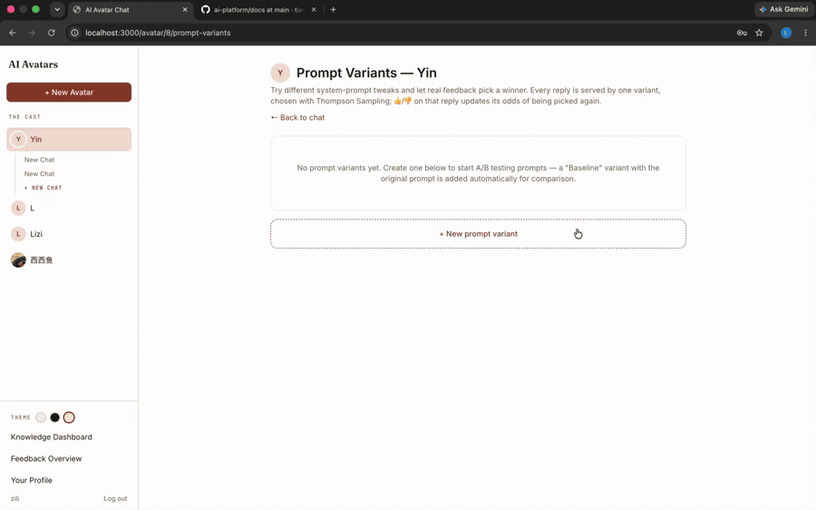
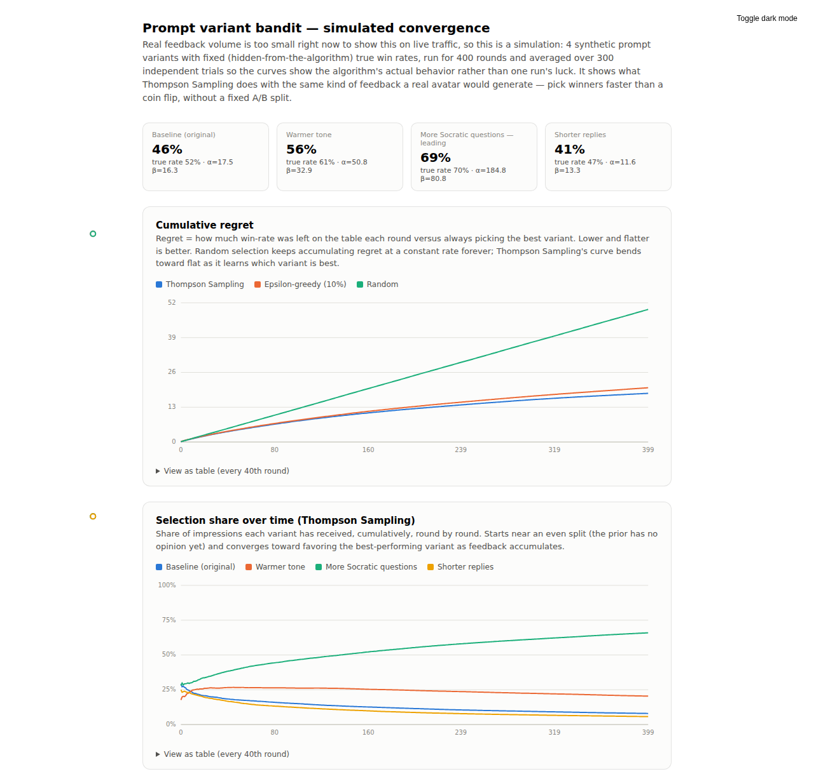

# Avatar AI

Create custom AI personas, chat with them over streaming responses, and ground the
conversation in your own documents — with a prompt-optimization layer that learns
from real user feedback instead of retraining any model.

Team capstone project (2 contributors). This README documents the whole product;
see [`CONTRIBUTIONS.md`](./CONTRIBUTIONS.md) for what I personally designed and built.

🎥 **[Watch the full demo, narrated (~1:20)](./docs/demo/avatar-ai-demo.mp4)**



## What it does

- **Custom AI personas.** Define a name, personality, speaking style, expertise, and
  topic tags; a system prompt is generated from these traits automatically.
- **Streaming chat** over Server-Sent Events, with PDF/image/code file attachments.
- **Retrieval-augmented generation.** Upload a document once and it's chunked,
  embedded, and indexed per avatar — every later question against that avatar can
  retrieve and cite the relevant passage, in any of 50+ languages.
- **Prompt A/B testing with a live bandit.** Each avatar can run several prompt
  variants side by side; a Thompson Sampling multi-armed bandit picks which variant
  answers each message and shifts traffic toward whichever one users actually
  approve of.
- **Feedback loop.** Every reply can be rated 👍/👎; ratings roll up into a
  per-avatar approval dashboard and feed directly back into the bandit above.
- **Full account management.** Sign up/login (JWT), edit your profile, change your
  password, and reset a forgotten password via a real transactional email (Resend).
- **Knowledge dashboard.** Tracks how well each avatar's topics are being understood
  over a user's conversation history.

## Why the bandit is the interesting part

The team wanted the app's response quality to improve from user feedback — the
usual promise of "reinforcement learning." But the app calls the closed-source
Anthropic API, so there's no model to fine-tune. "Learning" has to happen one layer
up, at the prompt: every reply is generated by one *prompt variant* of the avatar's
system prompt, chosen by a Thompson Sampling bandit that keeps a Beta(α, β)
posterior per variant and draws from it to balance exploring untested variants
against exploiting the one currently winning. A 👍/👎 updates that variant's
posterior directly.

A simulation (run over 300 independent trials, since a single run is noisy enough
to show a worse variant "winning" by chance) shows Thompson Sampling converging on
the best variant faster and with lower cumulative regret than epsilon-greedy or
random selection:



The full interactive report is at
[`backend/scripts/bandit_simulation.html`](./backend/scripts/bandit_simulation.html)
(open it directly in a browser, or regenerate it with
`python backend/scripts/simulate_bandit.py`).

## Tech stack

| Layer | Choice |
|---|---|
| Backend | FastAPI, SQLAlchemy (async) + SQLite, `sentence-transformers` for embeddings |
| Frontend | Next.js 14 (App Router), TypeScript, Tailwind CSS |
| AI | Anthropic Claude API (no model training — all "learning" happens at the prompt layer) |
| Auth | JWT (`python-jose`) + bcrypt password hashing |
| Email | Resend (transactional email for password reset) |
| Streaming | Server-Sent Events, FastAPI → browser |

## Project layout

```
backend/
  main.py                 FastAPI app entrypoint
  core/                    config, DB engine + idempotent SQLite migrations, security (JWT)
  models/                  User, Avatar, ChatSession, Message, PromptVariant, DocumentChunk, TopicMastery
  services/                chat streaming, RAG retrieval, bandit selection, feedback, email
  api/routes/              auth, avatars, chat, feedback, prompt-variants, mastery
  scripts/simulate_bandit.py   Thompson Sampling vs. epsilon-greedy vs. random simulation
frontend/
  app/                     pages: login, signup, forgot/reset-password, avatar/new,
                            chat/[avatarId], avatar/[avatarId]/prompt-variants,
                            feedback, dashboard, profile
  components/              chat UI, sidebar (per-avatar collapsible chat history), auth guard
  lib/                     API client, auth context, shared types
docs/
  PROMPT_VARIANTS.md        design doc for the bandit system
  RAG.md                    design doc for the retrieval pipeline
  demo/                     narrated demo video + highlight GIF
```

## Prerequisites

- Python 3.11+
- Node.js 18.18+ (or 20+) and npm
- An Anthropic API key ([console.anthropic.com](https://console.anthropic.com))
- A [Resend](https://resend.com) API key if you want password-reset emails to
  actually send (optional — everything else works without it)

## 1. Backend setup

```bash
cd backend
python -m venv .venv

# Windows (PowerShell)
.venv\Scripts\Activate.ps1
# macOS / Linux
source .venv/bin/activate

pip install -r requirements.txt

cp .env.example .env
# edit .env: set ANTHROPIC_API_KEY=sk-ant-...
# optional: RESEND_API_KEY=re_... for password-reset email
```

Run the API server:

```bash
uvicorn main:app --reload --port 8000
```

On first run this creates `backend/app.db` (SQLite) and the `uploads/` folders
automatically; all later schema changes run as idempotent `ALTER TABLE`
migrations, so pulling new code never requires deleting your local database.
Interactive API docs: `http://localhost:8000/docs`.

## 2. Frontend setup

```bash
cd frontend
npm install

cp .env.local.example .env.local
# NEXT_PUBLIC_API_URL should point at the backend, default http://localhost:8000
```

```bash
npm run dev
```

Open `http://localhost:3000` — you'll land on `/login`. Sign up, then create your
first avatar from the sidebar.

## Using the app

1. **Sign up / log in.** Accounts are local to your SQLite database. Forgot your
   password? Use the link on the login page (needs `RESEND_API_KEY` configured).
2. **Create an avatar** (`/avatar/new`) — name, personality, speaking style,
   expertise, topic tags, optional image.
3. **Chat** (`/chat/[avatarId]`) — streams token-by-token. Attach a PDF, image, or
   code file with the paperclip button; PDFs are chunked and embedded so later
   questions can retrieve and cite them, even in a different language than the
   document.
4. **Tune the prompt** (`Prompt Variants`, top-right of a chat) — add variants to an
   avatar's system prompt and let the bandit find the one users respond to best.
5. **Rate responses** with 👍/👎 — check `/feedback` for the aggregate approval rate
   per avatar.
6. **`/profile`** — update your username/email or change your password.
7. **`/dashboard`** — track topic mastery across your conversations.

## Notes

- All data is local: SQLite at `backend/app.db`, uploaded files under
  `backend/uploads/`. Nothing leaves the machine except calls to the Anthropic API
  (for chat) and Resend (only when a password reset is requested).
- The Anthropic model is configurable via `ANTHROPIC_MODEL` in `backend/.env`.
- JWTs are stored in `localStorage` and expire after 7 days by default.
